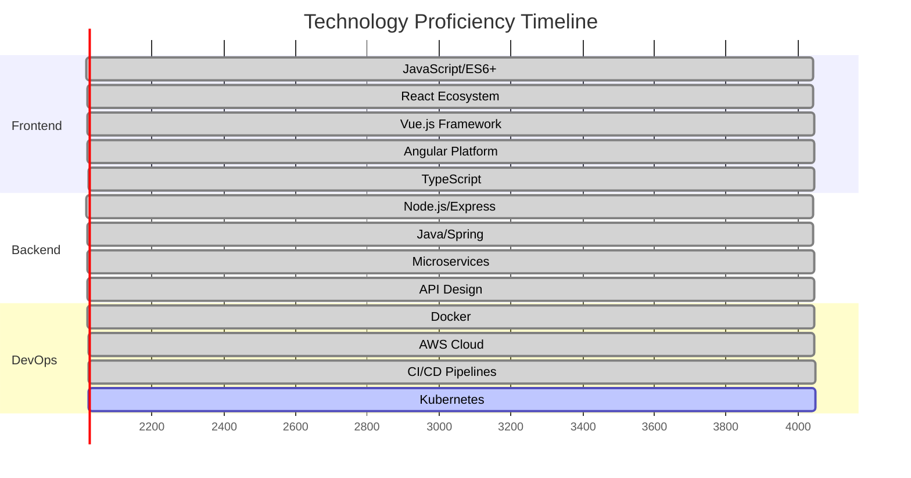

# Félix Domingos
**Pleno Full Stack Developer | Cloud & Microservices Specialist**

📍 Luanda, Angola | 🌍 Available for Global Remote Positions | 📧 felixsdomingos93@gmail.com

---

## 🎯 Professional Profile

Senior Full Stack Developer with extensive experience architecting and implementing scalable web applications using modern JavaScript/TypeScript ecosystems. Specialized in building **high-performance microservices architectures**, **cloud-native solutions**, and **enterprise-grade applications** with a focus on clean code principles and robust system design.

---

## 🚀 Core Competencies

<div align="center">
  
### **Frontend Architecture**


### **Backend Development**


### **Cloud & DevOps**


### **Data & Testing**


</div>

---

## 📈 Technical Proficiency Metrics

<div align="center">



</div>

---

## 🏆 GitHub Analytics

<div align="center">

<!-- GitHub Stats Cards -->


<!-- Top Languages -->


<!-- GitHub Trophy -->


</div>

---

## 🏗️ Architectural Expertise

### **System Design & Architecture**
- Microservices & Event-Driven Architectures
- RESTful & GraphQL API Design
- Monolith to Microservices Migration
- Cloud-Native Application Development
- Database Sharding & Replication Strategies

### **Performance Optimization**
- Frontend Bundle Optimization
- Database Query Optimization
- Caching Strategies Implementation
- CDN & Edge Computing Solutions
- Load Testing & Performance Monitoring

### **DevOps & Infrastructure**
- Infrastructure as Code (Terraform)
- Container Orchestration (Kubernetes)
- CI/CD Pipeline Design (GitHub Actions, Jenkins)
- Monitoring & Alerting (Prometheus, Grafana)
- Security & Compliance Implementation

---

## 📚 Professional Development

<div align="center">

| **Current Focus** | **Technologies** | **Status** |
|-------------------|------------------|------------|
| **Cloud Architecture** | AWS Solutions Architect | 📚 In Progress |
| **Container Orchestration** | Kubernetes Certified | 🎯 Target Q2 2024 |
| **System Design** | Advanced Patterns | 📈 Continuous |
| **Team Leadership** | Agile Methodologies | 📈 Continuous |

</div>

---

## 🔥 Featured Projects

### **Enterprise E-Commerce Platform**
> **Tech Stack:** React, Node.js, NestJS, PostgreSQL, Redis, Docker, AWS
- Led development of scalable microservices architecture serving 10k+ daily users
- Implemented real-time inventory management and payment processing
- Reduced page load time by 60% through performance optimization

### **Financial Analytics Dashboard**
> **Tech Stack:** Vue.js, Java Spring Boot, MongoDB, Kafka, Kubernetes
- Built real-time data visualization platform for financial institutions
- Implemented event-driven architecture for live data processing
- Designed secure multi-tenancy system with role-based access control

### **Healthcare Management System**
> **Tech Stack:** Angular, .NET Core, SQL Server, Azure, Docker
- Developed HIPAA-compliant patient management system
- Integrated third-party medical device APIs
- Implemented automated reporting and analytics module

---

## 🎯 Career Objectives

1. **Technical Leadership**: Architect and lead development of scalable, cloud-native applications
2. **Knowledge Sharing**: Mentor junior developers and contribute to technical communities
3. **Innovation**: Implement cutting-edge technologies to solve complex business problems
4. **Global Impact**: Collaborate with international teams on transformative digital projects

---

## 📞 Professional Network

<div align="center">

[](https://linkedin.com/in/felixdomingos)
[](mailto:felixsdomingos93@gmail.com)
[](https://felixdomingos.dev)
[](https://github.com/felixdomingos1)

</div>

---

## 📊 Development Philosophy

> "Software engineering is not just about writing code—it's about creating sustainable, scalable solutions that deliver real business value while maintaining technical excellence and team collaboration."

---

<div align="center">


<br/>


*"Excellence in software development is a journey, not a destination."*

</div>

---

<div align="center">
  
```javascript
const felixDomingos = {
  role: "Pleno Full Stack Developer",
  location: "Luanda, Angola",
  availability: "Open to Remote Opportunities",
  specialties: [
    "Microservices Architecture",
    "Cloud-Native Development",
    "System Design & Scalability",
    "DevOps & CI/CD Implementation"
  ],
  philosophy: "Build solutions that are maintainable, scalable, and deliver real value.",
  contact: "felixsdomingos93@gmail.com"
};
```

</div>

---
